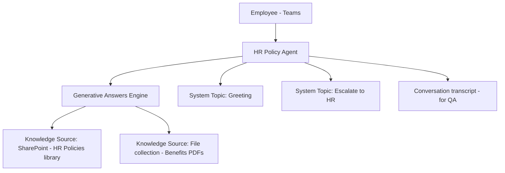

# Project 1 — KB-Agent-101: Grounded Knowledge Q&A Agent
### 🟢 Difficulty: Beginner

**Copilot Studio capability focus:** Knowledge sources, generative answers, topics, basic authoring
**Data Source:** SharePoint document library + uploaded files
**Baseline:** Copilot Studio, as of July 2026 (Copilot Credits model, immersive Prompt Builder GA, file-collection knowledge sources)

---

## 1. What you're building

An HR policy assistant that answers employee questions ("How many casual leave days do I get?", "What's the WFH policy?") by grounding its answers in a real SharePoint document library — with citations, not hallucinated guesses. This is the correct **first Copilot Studio project** because it teaches the two things every later project depends on: how knowledge grounding actually works, and how classic topics vs. generative answers interact.

## 2. Why this is genuinely "Beginner" (and why that's not a bad thing)

No actions, no connectors, no orchestration — just: connect a knowledge source, write good topic descriptions, test grounding quality, and publish to one channel (Teams). This is deliberately scoped so you can complete it in an afternoon and understand *every single piece* of what's happening, before adding complexity in later projects.

## 3. Architecture

## 4. Step-by-step

1. **Create the agent** in Copilot Studio (Standard/free trial or M365 Copilot-included Agent Builder tier is enough for this project — no standalone license needed if internal-only and users are M365 Copilot licensed).
2. Give it a clear **name, description, and instructions** — the description is what the orchestrator/planner later uses to decide when to route to this agent, so write it like a job description, not a title.
3. Add a **knowledge source**: connect the SharePoint "HR Policies" document library directly (no need to copy files — Copilot Studio indexes it in place).
4. Add a **file collection** knowledge source: upload 4-5 benefits PDFs as a named collection, with a short natural-language instruction on when to prefer this collection over the SharePoint one.
5. Turn on **generative answers** and test with real employee phrasing, not just the FAQ wording — this is where most beginner agents fail (they only work for exact phrasing).
6. Add one **classic topic**: "Escalate to HR" — trigger phrases like "I want to talk to a person" — that ends the conversation with a Teams handoff message and logs the reason.
7. Use the **test panel's citation view** to confirm every generative answer shows its source document — if it doesn't, the knowledge source isn't configured correctly.
8. **Publish** to Microsoft Teams only for this project (the simplest, lowest-governance channel).
9. Review the **activity map** the first day it's live to see whether the planner is choosing knowledge grounding vs. a topic correctly, and tune topic descriptions accordingly.

## 5. Token / Copilot Credit utilization

This is the cheapest possible agent pattern, and it's worth understanding the exact mechanics before you build anything more complex:

| Interaction type | Approx. Copilot Credits | Notes |
|---|---|---|
| Generative answer grounded on SharePoint/file knowledge | ~2 credits | Cheapest generative interaction type |
| Classic topic (no generative AI) | 0 credits | Pure dialog-tree topics don't consume credits |
| Tenant-graph grounding (M365 Graph — emails, calendar, etc.) | ~10 credits | **Not used in this project** — reserved for later projects that ground on Graph |

**License reality for this project:** if every user is a licensed Microsoft 365 Copilot user and the agent only runs inside Teams/SharePoint/Copilot Chat, this usage is **largely zero-rated** (included, subject to fair-use limits) — you will likely pay **$0** in Copilot Credits for this entire project. The moment you publish this same agent to an anonymous public web channel, or let unlicensed users access it, it becomes a **standalone Copilot Studio** scenario and starts consuming metered credits. Keep this project internal-only to stay free.

## 6. Licensing checklist
- ✅ Microsoft 365 Copilot licensed users only, Teams channel → no standalone Copilot Studio license required
- ⚠ If any test users are unlicensed, use the **free Copilot Studio trial** (30 days, extendable once) rather than paying anything
- 🚫 Do not publish anonymously yet — that belongs to Project 2

## 7. Demo script
1. Ask a real policy question in natural phrasing — show the cited-source answer.
2. Ask something genuinely not covered — show it says "I don't know" instead of guessing.
3. Ask "I want to talk to a human" — show the escalation topic firing cleanly.
4. Open the activity map and show which knowledge source/topic the planner picked and why.

## 8. Skills this project proves
Knowledge grounding fundamentals, generative-answer tuning, citation verification, and reading the orchestration activity map — the foundation every other project in this repo builds on.

**🔗 Live HTML mockup:** see `index.html` in this folder.
