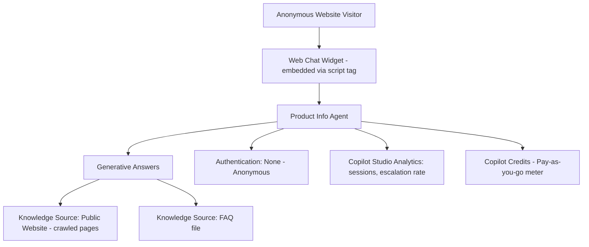

# Project 2 — WebGround-Agent: Public Website Grounding & Anonymous Web Channel Agent
### 🟢 Difficulty: Beginner

**Copilot Studio capability focus:** Public website knowledge source, anonymous authentication, Web channel/Custom canvas publishing
**Data Source:** Public website content + a small FAQ knowledge source
**Baseline:** Copilot Studio, as of July 2026

---

## 1. What you're building

A "Product Info Assistant" for a company's public marketing website — answers visitor questions about product specs and pricing pages by grounding directly on the live website content, and is published as an **anonymous, public-facing web widget**. This is the natural second beginner project because it introduces the concept that changes your licensing story: **external, unauthenticated users**.

## 2. Why this is the right second project

Project 1 taught grounding; this one teaches the **cost and governance boundary** that trips up almost everyone new to Copilot Studio — the instant an agent is public-facing, it moves from "probably free" to "definitely metered," regardless of whether your internal users have M365 Copilot licenses.

## 3. Architecture

## 4. Step-by-step

1. Create a new agent; add a **Website** knowledge source pointing at the public marketing site's URL — Copilot Studio crawls and indexes the pages you allow.
2. Add a small **FAQ knowledge source** (a text/Word file) for the handful of questions the raw website content answers poorly (pricing nuances, refund policy).
3. Configure **authentication: No authentication (anonymous)** — this is the setting that formally makes the agent externally-facing.
4. Publish to the **Web** channel — Copilot Studio gives you an embeddable script tag; add it to a test page.
5. Also try publishing a **Custom canvas** version (branded chat UI matching the website's look) instead of the default widget, to show maker-level polish.
6. Turn on **Copilot Studio analytics**: track session count, resolution rate, and top unanswered questions.
7. Set up **content moderation and off-topic guardrails** — anonymous public agents need boundaries (e.g., refuse to discuss competitors, refuse to give legal/financial advice) configured explicitly in instructions.
8. **Set up billing before going live**: link the environment to an Azure subscription (pay-as-you-go) or assign it Copilot Credit capacity from a prepaid pack — an anonymous agent with no billing configured will hit enforcement once trial capacity is exhausted.

## 5. Token / Copilot Credit utilization

This is the project where credits become real money, so plan for it explicitly:

| Interaction type | Approx. Copilot Credits | Notes |
|---|---|---|
| Generative answer grounded on website/FAQ | ~2 credits | Same base rate as Project 1 |
| Anonymous session overhead | Same per-message rate | No "anonymous surcharge" — the difference is *whether* it's zero-rated at all, not the per-message cost |

**The key licensing fact this project demonstrates:** because users are anonymous and the agent is published to a public external channel, **none of this usage is zero-rated** — every single generative answer consumes Copilot Credits from your standalone Copilot Studio license, even though the underlying per-answer cost (~2 credits) is identical to Project 1's "free" usage. This is the exact boundary the licensing guides call out as the biggest source of unplanned bills.

**Estimating cost:** at ~2 credits/answer and a $0.01/credit pay-as-you-go rate, 10,000 visitor questions/month ≈ 20,000 credits ≈ **$200/month** — right at the edge of one prepaid capacity pack (25,000 credits for $200/month). This is exactly the kind of math you should run *before* publishing, using Microsoft's Copilot Studio agent usage estimator.

## 6. Licensing checklist
- 🔴 Standalone Copilot Studio license **required** (this is an external, unlicensed-user scenario — M365 Copilot inclusion does not cover it)
- Choose **pay-as-you-go** ($0.01/credit via Azure) while traffic is unpredictable; move to a **prepaid capacity pack** ($200/25,000 credits/month) once volume stabilizes
- If a **Managed Environment** is turned on (recommended for anything public-facing), confirm every active *maker* — not the anonymous end users — is properly licensed; anonymous end users are covered by the environment's Copilot Credit billing, not individual licenses

## 7. Demo script
1. Open the public web widget in an incognito window (proving no login/auth) and ask a product question — show a grounded, cited answer.
2. Ask an off-topic/competitor question — show the guardrail politely declining.
3. Open the Copilot Studio analytics dashboard — show session volume and top unanswered questions.
4. Show the **usage estimator** output side-by-side with actual consumption from the analytics view — prove you can forecast cost before scaling traffic.

## 8. Skills this project proves
Public/anonymous channel publishing, website-source grounding, guardrail authoring for unlicensed external users, and — critically — Copilot Credit cost forecasting for external-facing agents.

**🔗 Live HTML mockup:** see `index.html` in this folder.
