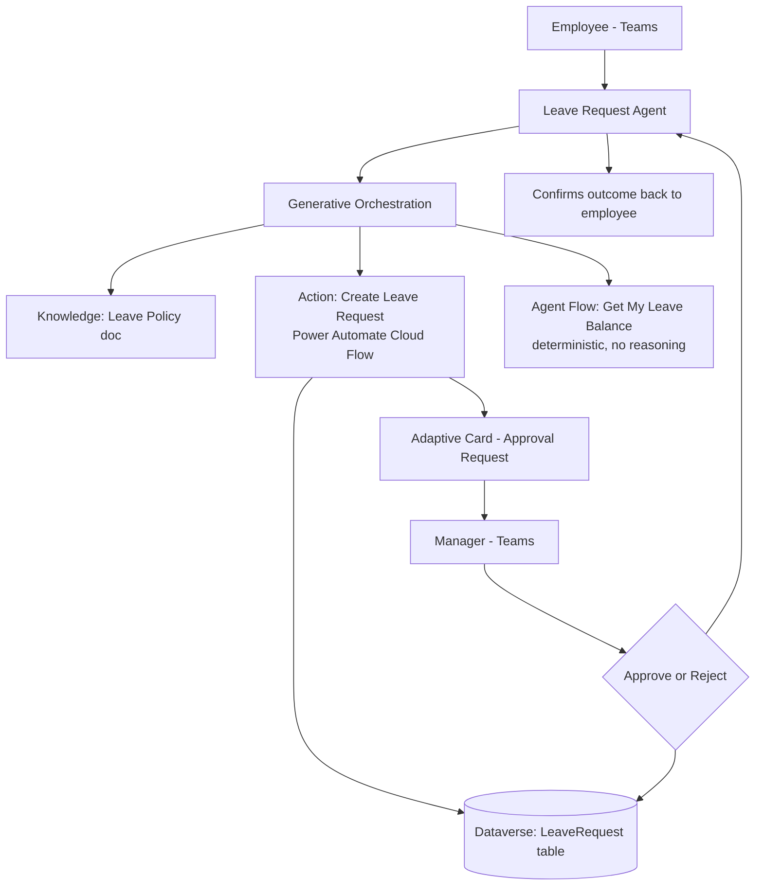

# Project 3 — FlowConnect-Agent: Power Automate Actions & Adaptive Cards Agent
### 🟡 Difficulty: Intermediate

**Copilot Studio capability focus:** Actions backed by Power Automate cloud flows, agent flows, Adaptive Cards, generative orchestration action selection
**Data Source:** Dataverse `LeaveRequest` table (behind the flow), Outlook, Teams
**Baseline:** Copilot Studio, as of July 2026 — Agent flows GA, generative orchestration action selection

---

## 1. What you're building

A "Leave Request Assistant" that doesn't just answer questions (Project 1 territory) but *does things*: an employee can say "I want to take leave from July 20 to July 22" and the agent collects the missing details, creates a real leave request record via a **Power Automate cloud flow**, and sends the manager an **Adaptive Card approval** in Teams — then reports the outcome back in the conversation.

## 2. Why this is Intermediate

This is the first project where the agent takes a **state-changing action** rather than just retrieving information. That introduces real design problems: confirming before acting, handling flow failures gracefully, and choosing between an **agent flow** (deterministic, no reasoning per step) and a full **Power Automate cloud flow action** (more powerful, more credit cost) for different parts of the job.

## 3. Architecture

## 4. Step-by-step

1. Build the backing **Power Automate cloud flow** first, independent of Copilot Studio: trigger = "Run a flow from Copilot," inputs = employee, start date, end date, reason; logic = check leave balance in Dataverse, create `LeaveRequest` record, send an **Adaptive Card approval** to the manager via Teams, wait for response, update the record.
2. Build a separate, simpler **agent flow** (Copilot Studio's lighter-weight flow type) for "Get My Leave Balance" — a pure lookup with no reasoning needed at each step, which is cheaper and faster than invoking a full cloud flow action.
3. In Copilot Studio, add both as **actions** on the agent: the cloud flow as a rich action with clear input/output descriptions, the agent flow as a simple lookup action.
4. Enable **generative orchestration** and write precise action descriptions — this is what lets the planner correctly decide "check my balance" → agent flow, vs. "request leave" → cloud flow action, from natural phrasing alone.
5. Add an explicit **confirmation step** in the topic/instructions before the create-record action fires: "You're requesting leave from July 20–22 for a family event — should I submit this?"
6. Test **failure handling**: temporarily break the flow's connection and confirm the agent reports a clear, honest failure message instead of pretending it succeeded.
7. Add a **post-action follow-up**: once the manager responds to the Adaptive Card, the flow should be able to notify the original conversation (or the employee via proactive message) of the outcome.
8. Review the **activity map** to see the actual sequence: which action was called, what parameters were extracted from natural language, and how many credits it consumed per turn.

## 5. Token / Copilot Credit utilization

This project is where credit cost starts depending heavily on **design choices**, not just usage volume:

| Interaction type | Approx. Copilot Credits | Notes |
|---|---|---|
| Generative answer (leave policy question) | ~2 credits | Same as Project 1 |
| Agent flow action call (deterministic, no reasoning) | ~5 credits per action in generative orchestration mode | Cheaper than a full reasoning-heavy cloud flow turn |
| Full action/topic turn combining reasoning + action call | Can combine multiple components (e.g., 2 + 5 = ~7 credits for a grounded answer that also triggers an action) | Credits stack per feature used in a single turn, not per turn flatly |
| Autonomous trigger scenario (e.g., a scheduled reminder flow that proactively pings employees) | 25 credits per autonomous trigger | Applies **even for M365 Copilot licensed users** — autonomous/proactive triggers are never zero-rated |

**Design lesson to call out explicitly:** the "Get My Leave Balance" **agent flow** was deliberately built as a lightweight, non-reasoning action instead of a full generative action, specifically to keep frequent, simple lookups cheap. This is a real architectural decision, not a technicality — at scale, routing 80% of "just tell me X" requests through agent flows instead of full reasoning actions materially changes your monthly Copilot Credit bill.

## 6. Licensing checklist
- Internal-only, M365 Copilot licensed users, Teams channel → **base conversation is zero-rated**, but action/agent-flow calls still draw from the **agent flow actions** billing line even for licensed users in some configurations — verify current behavior in the Copilot Credit billing rates page before assuming full zero-rating
- If you later add a **scheduled/autonomous trigger** (e.g., "remind me 3 days before my leave balance resets"), budget for the flat 25-credit-per-trigger charge regardless of license status
- Power Automate premium connectors used inside the flow (e.g., Dataverse) require appropriate **Power Automate/Power Apps per-user or per-flow licensing** separate from Copilot Credits — these are two different billing systems that both apply here

## 7. Demo script
1. Ask the balance question — show the cheap agent-flow lookup answer.
2. Request leave in natural language — show the confirmation step, then the Adaptive Card landing in the manager's Teams.
3. Approve it as the manager — show the agent reporting the outcome back to the employee.
4. Deliberately break the flow connection and show a graceful failure message instead of a silent hang.
5. Open the activity map and point to the exact credit-consuming steps per turn.

## 8. Skills this project proves
Designing state-changing agent actions safely (confirm-before-act), choosing agent flows vs. full cloud flow actions for cost efficiency, Adaptive Card human-in-the-loop approval patterns, and reading per-turn Copilot Credit consumption to make real architectural trade-offs.

**🔗 Live HTML mockup:** see `index.html` in this folder.
