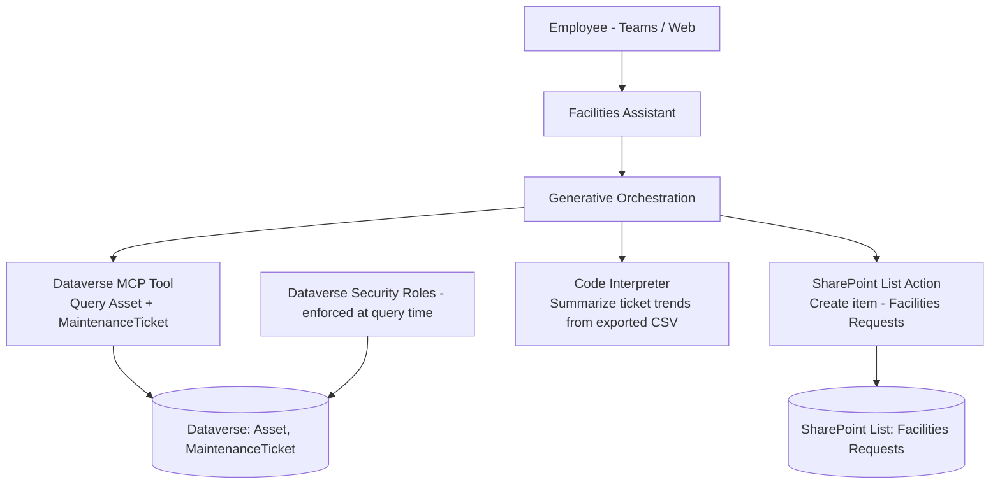

# Project 4 — DataLink-Agent: SharePoint & Dataverse Structured Data Agent
### 🟡 Difficulty: Intermediate

**Copilot Studio capability focus:** Native Dataverse connector actions, SharePoint list actions, structured CRUD via conversation, Dataverse MCP tool, code interpreter for light data ops
**Data Source:** Dataverse `Asset` and `MaintenanceTicket` tables + a SharePoint "Facilities Requests" list
**Baseline:** Copilot Studio, as of July 2026 — Dataverse MCP tool support, code interpreter GA for CSV/Excel analysis

---

## 1. What you're building

A "Facilities Assistant" that lets employees ask structured, data-driven questions ("Which assets in Building 3 have open maintenance tickets?", "Log a new facilities request for a broken AC in Room 214") against **real structured data** in Dataverse and SharePoint — not just documents. This is the natural progression from Project 1 (unstructured knowledge) into structured, queryable, and writable enterprise data.

## 2. Why this is Intermediate

Unlike knowledge grounding, structured data actions require you to think about **query shape** (filters, joins across two tables), **write safety** (who can create/update records via conversation), and **row-level security** (the agent must never show a user data their Dataverse security role wouldn't otherwise let them see).

## 3. Architecture

## 4. Step-by-step

1. Confirm the **Dataverse security model** first: the signed-in user's security role must already restrict which `Asset`/`MaintenanceTicket` records they can see — the agent inherits this, it does not bypass it.
2. Add the **Dataverse MCP server/tool** to the agent (via the MCP tool picker, filtered to Model Context Protocol) to enable natural-language querying across `Asset` and `MaintenanceTicket` without hand-building a custom query action for every possible question.
3. Add a **SharePoint "Create item" action** on the Facilities Requests list, with clear parameter descriptions (Location, Issue Description, Urgency) so the planner extracts them correctly from conversational input.
4. Write **explicit read-vs-write guardrails** in the agent's instructions: read/query actions can run without confirmation; the create-item action must always confirm details with the user first.
5. Test **cross-table reasoning**: "Which assets in Building 3 have open tickets older than 10 days?" requires the planner to correctly combine two data sources in one answer — tune tool descriptions until this works reliably.
6. Add **code interpreter** for one advanced scenario: let a facilities manager upload a CSV export of ticket history and ask "which building has the most repeat AC issues this quarter?" — the agent writes and runs the Python analysis live.
7. Validate **security boundary testing**: log in as two different test users with different Dataverse security roles and confirm each only ever sees their permitted records through the agent — never assume the LLM will "know" to filter; the filtering must happen at the data layer.
8. Publish internally first (Teams), and only consider external publishing after the security testing above is fully signed off — this table pattern is exactly the kind of thing that shouldn't be rushed to a public channel.

## 5. Token / Copilot Credit utilization

| Interaction type | Approx. Copilot Credits | Notes |
|---|---|---|
| Dataverse MCP tool query (read) | ~5 credits (billed as an action/tool call) | Same action-tier rate regardless of query complexity |
| SharePoint create-item action | ~5 credits | Write actions cost the same tier as reads — cost isn't the safety control, your confirmation-step design is |
| Code interpreter analysis (CSV/Excel) | Billed under the **premium/advanced reasoning tool tier** | Higher per-use cost than a simple action call — reserve for genuinely complex analysis, not routine lookups |
| Combined turn (grounded answer + MCP query + reasoning) | Credits stack per feature | A single "smart" answer can realistically cost 10-15+ credits when it chains grounding + a tool call + light reasoning |

**Cost-conscious design decision to highlight:** simple, high-frequency questions ("what's my asset's warranty status?") were kept to a single MCP query action rather than routed through code interpreter, which is reserved only for genuinely open-ended analysis (the CSV trend question). This tiering — cheap deterministic actions for routine questions, expensive reasoning tools only when truly needed — is a real cost-governance skill, not an implementation detail.

## 6. Licensing checklist
- Dataverse MCP tool requires the environment to have the relevant **Dataverse Intelligence / MCP server features** enabled at the environment settings level (Power Platform admin center) — this is an environment configuration step, not just an agent setting
- Standard **Dataverse per-user or per-app licensing** still applies independently of Copilot Credits — Copilot Credits pay for the *agent's* consumption, not for underlying Dataverse API entitlements
- SharePoint list actions use the standard SharePoint connector — confirm it's on your **DLP-approved connector list** before enabling the action

## 7. Demo script
1. Ask a simple structured lookup — show a fast, cheap, correctly filtered answer.
2. Ask the cross-table question (assets + tickets) — show the planner reasoning across two sources in the activity map.
3. Create a new facilities request conversationally — show the confirmation step before the SharePoint item is created.
4. Upload a CSV and ask the trend question — show code interpreter generating a chart live in the conversation.
5. Log in as a second, more restricted test user and show they only see their permitted subset of assets.

## 8. Skills this project proves
Structured data grounding via MCP, safe write-action design with confirmation gates, Dataverse row-level security inheritance through a conversational layer, and cost-tiered tool selection (cheap deterministic actions vs. expensive reasoning tools).

**🔗 Live HTML mockup:** see `index.html` in this folder.
