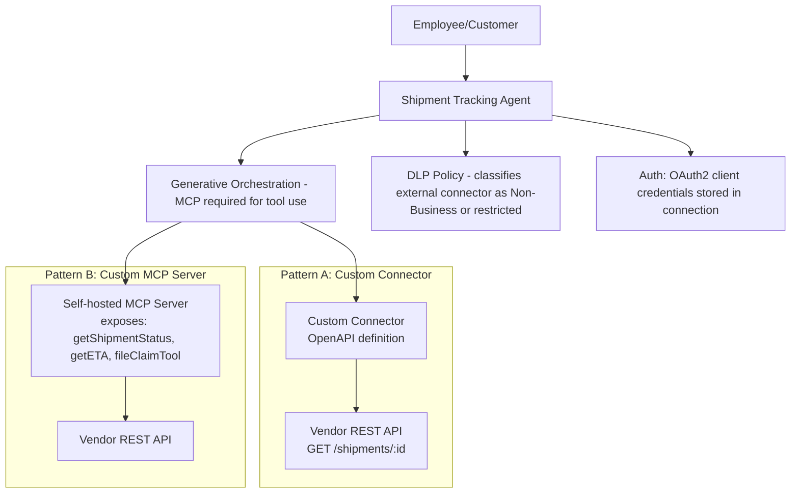

# Project 5 — APIBridge-Agent: Custom REST API & Custom MCP Server Integration Agent
### 🟠 Difficulty: Advanced

**Copilot Studio capability focus:** Custom connectors, authenticated external REST APIs, building and publishing a custom MCP server, secure credential handling
**Data Source:** A third-party shipment-tracking REST API (external system, not Microsoft) + a custom-built MCP server
**Baseline:** Copilot Studio, as of July 2026 — MCP general availability, custom connector infrastructure, Apps SDK support

---

## 1. What you're building

A "Shipment Tracking Assistant" that connects Copilot Studio to a **non-Microsoft external system** — a logistics vendor's REST API — two different ways, so you understand both integration patterns available in 2026: (a) a **custom connector** wrapping the REST API directly, and (b) a **custom MCP server** you build and host yourself, exposing the same capability as standardized MCP tools. This is the first project where you're integrating outside the Microsoft ecosystem.

## 2. Why this is Advanced

This requires understanding **authentication flows** (API keys, OAuth2 client credentials) outside Entra ID, **custom connector authoring** (OpenAPI definitions, request/response shaping), and **standing up and hosting an MCP server** — genuine software engineering, not just low-code configuration. It's also where **security accountability shifts**: Microsoft's own MCP documentation is explicit that once you connect to a non-Microsoft/external MCP server, you are responsible for the tools and resources you access from within Copilot Studio.

## 3. Architecture

## 4. Step-by-step

### Pattern A — Custom Connector (do this first, it's the simpler pattern)
1. Obtain API credentials from the logistics vendor (API key or OAuth2 client credentials).
2. Author a **custom connector** using the vendor's OpenAPI/Swagger definition (or build one manually): define the `GET /shipments/{id}` operation, its parameters, and response schema.
3. Configure the connector's **authentication type** to match the vendor (API key header or OAuth2) and store credentials securely in the connection, never in agent instructions or topic text.
4. Add the custom connector as an **action** on the agent; write a precise description ("Look up real-time shipment status and ETA given a tracking number") so the planner selects it correctly.
5. Apply a **DLP policy classification** to the custom connector (Business/Non-Business/Blocked) appropriate to the sensitivity of the data it exposes.

### Pattern B — Custom MCP Server (the deeper, more durable pattern)
6. Build an **MCP server** using one of the official SDKs, exposing three tools: `getShipmentStatus`, `getETA`, and `fileClaimTool` (for damaged/lost shipments) — each with clear input/output schemas.
7. Host the server (e.g., as an Azure Function or container app) with proper authentication on the server itself, separate from Copilot Studio's own auth layer.
8. **Publish the MCP server through a connector** so it can be governed like any other connector: enterprise security, DLP, Virtual Network integration, and multiple authentication methods all apply.
9. In Copilot Studio, use the **MCP onboarding wizard** to connect the agent to your server; confirm **generative orchestration is turned on** (required for MCP) and that the tools appear automatically with the names/descriptions/schemas your server defined.
10. Update one tool on the live MCP server (e.g., add a new optional parameter to `getETA`) without touching Copilot Studio at all — confirm the agent picks up the change dynamically, demonstrating the maintenance advantage of MCP over hand-built custom connectors.
11. Document a clear **security accountability note**: because this is a non-Microsoft, self-hosted MCP server, your team — not Microsoft — owns vetting the server's behavior, data handling, and uptime.

## 5. Token / Copilot Credit utilization

| Interaction type | Approx. Copilot Credits | Notes |
|---|---|---|
| Custom connector action call | ~5 credits (standard action tier) | Same tier as any other action — external REST calls aren't "cheaper" just because they're outside Microsoft |
| MCP tool call | ~5 credits (standard action tier), same billing surface as connector actions | MCP doesn't have its own separate credit meter — it rides the standard action/tool consumption line |
| Premium/advanced reasoning needed to interpret unstructured vendor API responses | Higher, premium AI tool tier | If the vendor API returns messy/unstructured text requiring a reasoning pass to interpret, that reasoning step is billed at the premium tool rate, not the base action rate |

**Architecture decision that affects cost and governance:** Pattern B (custom MCP server) has **no ongoing Copilot Credit cost advantage** over Pattern A (custom connector) — the credit meter doesn't care which pattern you used. The real trade-off is engineering cost and governance: MCP centralizes tool definitions on a server you control and can update without republishing the agent, while a custom connector's schema lives inside the Power Platform connector definition itself. Choose based on how often the external API's shape changes and how many agents will reuse the same tools — not based on credits.

## 6. Licensing checklist
- Standalone Copilot Studio license required if this agent will ever be customer-facing (likely, for shipment tracking)
- Custom connectors and custom MCP servers both require **Premium connector** entitlements in the underlying Power Platform license (per-app or per-user premium plan) — separate from Copilot Credits
- If the MCP server is hosted on Azure infrastructure you own (Functions, Container Apps, App Service), budget **Azure compute costs** as a fully separate line item from Copilot Credits — this is the "multi-layer invoice" problem enterprises consistently underestimate
- Explicit sign-off required from security/compliance for any external, non-Microsoft MCP server before production use — document who owns this in your governance runbook

## 7. Demo script
1. Ask for a shipment status via the custom connector — show the live API response.
2. Ask the same kind of question routed through the MCP server tools instead — show it behaves identically to the end user, proving the pattern choice is invisible to them.
3. Update a tool definition on the live MCP server and show Copilot Studio picking up the change without republishing the agent.
4. Walk through the DLP classification and the "who owns this external server" governance note — this is the part that satisfies a security review.

## 8. Skills this project proves
Custom connector authoring against real external OpenAPI-described systems, building and hosting a genuine MCP server, understanding the security-accountability shift for non-Microsoft MCP integrations, and making an informed architecture choice between connector-based and MCP-based external tool integration.

**🔗 Live HTML mockup:** see `index.html` in this folder.
