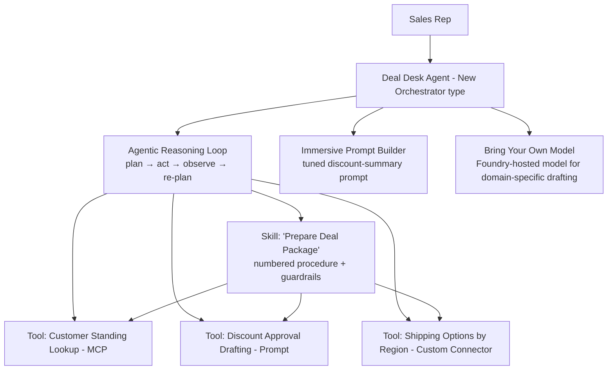

# Project 6 — OrchestrAI-Agent: Generative Orchestration, Skills & the New Orchestrator
### 🟠 Difficulty: Advanced

**Copilot Studio capability focus:** New Orchestrator (Agentic Reasoning Loop), reusable Skills, Prompt Builder (immersive), Bring Your Own Model, deep reasoning toggle
**Data Source:** Multiple knowledge sources + multiple tools chained in a single turn
**Baseline:** Copilot Studio, as of July 2026 — New Orchestrator generally available, immersive Prompt Builder GA, model choice via Microsoft Foundry (11,000+ models)

---

## 1. What you're building

A "Deal Desk Assistant" for a sales team that handles genuinely multi-step requests in a single turn — "Check if this customer is in good standing, then draft a discount approval summary, and tell me what shipping options are available for their region" — by using the **New Orchestrator's Agentic Reasoning Loop** to plan, call multiple tools, and synthesize a coherent answer, rather than picking exactly one tool per turn like standard generative orchestration (Project 3/4's pattern).

## 2. Why this is Advanced

Standard generative orchestration (used in Projects 3-4) is a **single-pass planner**: one tool, topic, or knowledge source per user turn. This project deliberately pushes past that into the **New Orchestrator**, which runs an agentic loop — plan, act, observe, re-plan — to complete genuinely multi-step tasks autonomously within one turn. That power comes with new problems: harder-to-predict credit cost, harder-to-debug reasoning chains, and the need to package reusable multi-step logic into named **Skills** instead of sprawling instructions.

## 3. Architecture

## 4. Step-by-step

1. Create the agent as a **new-type agent** (the New Orchestrator / Agentic Reasoning Loop), not the classic generative orchestration type — this is a fundamental agent-creation choice, not a settings toggle you flip later.
2. Register the three underlying tools individually first (customer standing MCP tool, a Prompt Builder-based drafting tool, a shipping custom connector) and verify each works correctly **in isolation** before combining them.
3. Package the multi-step "prepare a deal package" logic into a named **Skill**: a clear "when to use me" trigger description, the ordered tools it calls, and explicit **guardrails for when not to act** (e.g., never auto-approve a discount above 15% — always require human sign-off).
4. Use the new **immersive Prompt Builder** (now living directly in the agent's Tools tab) to iteratively tune the discount-summary drafting prompt without leaving the agent-editing context — compare this workflow to the old separate-editor experience to appreciate why it matters at scale.
5. Configure **Bring Your Own Model**: connect a Microsoft Foundry-hosted model fine-tuned or selected for higher-quality domain-specific drafting, instead of the default model, for the summary-generation tool specifically.
6. Turn on the **deep reasoning** toggle for this agent and compare response quality and latency against it turned off, on a handful of genuinely ambiguous multi-step requests.
7. Test the **guardrail**: ask it to approve a 25% discount directly — confirm the Skill's explicit guardrail stops it from completing the action and instead routes to a human approval step.
8. Use the **Get rationale** / activity map view to inspect the full plan → act → observe → re-plan trace for one complex request, and use that trace to fix a case where the planner chose a suboptimal tool order.

## 5. Token / Copilot Credit utilization

This is the project where you must stop thinking "per message" and start thinking "per reasoning loop":

| Interaction type | Approx. Copilot Credits | Notes |
|---|---|---|
| Single tool call within the loop | ~5 credits each | Same base action rate as earlier projects |
| Deep reasoning / advanced planning pass | **Premium text and generative AI tool tier** | Billed at a materially higher rate than basic generative answers — this is the "premium tools" charge referenced in the Copilot Credit rate card |
| One full multi-step Skill execution (3 tool calls + 1 reasoning/drafting pass + final synthesis) | Realistically 25-40+ credits in a single user turn | The Agentic Reasoning Loop can invoke several tools *and* a premium reasoning pass before returning one answer — a single "smart" turn here can cost more than 10 turns of Project 1's simple grounded Q&A |
| Bring Your Own Model (Foundry-hosted) | Copilot Credits (for the Copilot Studio orchestration) **plus separate Azure OpenAI/Foundry token charges** for the model inference itself | This is the clearest example in this repo of the "two invoices" problem — budget both lines separately |

**The governance lesson to present explicitly:** the New Orchestrator's power (autonomous multi-tool reasoning) is directly proportional to its cost unpredictability. Use **monthly consumption caps per agent** (configurable in the Power Platform admin center) on any agent using the Agentic Reasoning Loop in production, specifically because a single confusing user request can trigger an expensive, multi-step reasoning chain you didn't fully anticipate at design time.

## 6. Licensing checklist
- New-type (New Orchestrator) agents and Skills require the same standalone/PAYG Copilot Studio licensing as any other agent — there's no separate SKU for "advanced orchestration"
- Bring Your Own Model via Microsoft Foundry requires an **Azure subscription with Foundry/Azure OpenAI access** provisioned and billed independently
- Set a **per-agent monthly Copilot Credit cap** for this agent specifically (Power Platform admin center → Manage Agents) before production — this is the single most important governance control for New-Orchestrator-type agents

## 7. Demo script
1. Ask the multi-step deal-package question — show the agent autonomously chaining three tools into one coherent answer.
2. Open the rationale/activity trace and narrate the plan → act → observe → re-plan sequence.
3. Ask for an out-of-policy discount approval — show the Skill's guardrail blocking autonomous approval and routing to a human.
4. Show the Copilot Credit consumption for that one complex turn versus a simple Project-1-style question, side by side, to make the cost-per-complexity point concrete.

## 8. Skills this project proves
Designing for autonomous multi-step reasoning (New Orchestrator/Agentic Reasoning Loop), packaging reusable logic as governed Skills with explicit guardrails, Bring-Your-Own-Model integration via Foundry, and — critically — credit cost governance for unpredictable, high-value reasoning chains.

**🔗 Live HTML mockup:** see `index.html` in this folder.
