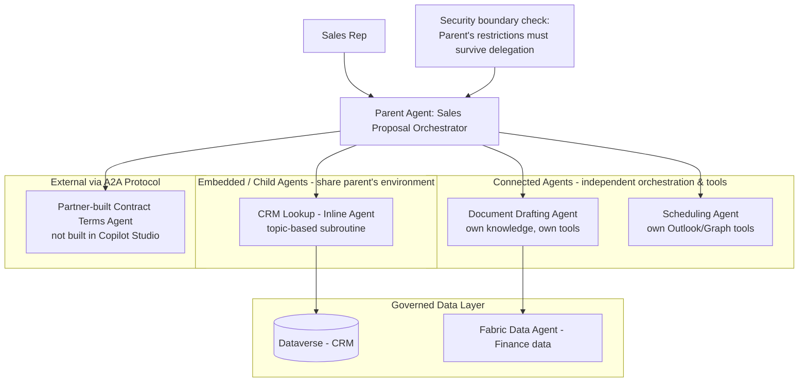

# Project 7 — MultiAgentMesh: Enterprise Multi-Agent Orchestration System
### 🔴 Difficulty: Expert

**Copilot Studio capability focus:** Embedded (child) agents, connected agents, Agent2Agent (A2A) interoperability, Fabric Data Agents, cross-agent security boundaries
**Data Source:** Multiple domains — CRM (Dataverse), Finance (Fabric Data Agent), Scheduling (Outlook/Graph)
**Baseline:** Copilot Studio, as of July 2026 — multi-agent orchestration GA (April 2026), A2A interoperability, Fabric-aware reasoning

---

## 1. What you're building

A "Sales Proposal Mesh" mirroring the real-world pattern Microsoft itself used to scale its own "Ask Microsoft" web agent: a **parent orchestrator agent** that delegates to specialized agents — a **CRM Agent** (embedded/child) that fetches account data, a **Document Agent** (connected agent) that drafts the proposal, a **Scheduling Agent** (connected agent) that books the follow-up call — with the parent aggregating results into one coherent conversation, and even reaching outside Copilot Studio entirely via **A2A** to a partner-built agent for contract terms lookup.

## 2. Why this is Expert

This is the point where you stop building "an agent" and start building a **distributed system of agents** — with all the distributed-systems problems that implies: data handoff between agents, security boundaries that must not be silently bypassed by delegation, versioning of independently-owned connected agents, and now, interoperability with agents built entirely outside your platform via an open protocol (A2A).

## 3. Architecture

## 4. Step-by-step

1. Design the **delegation map on paper first**: which agent owns which capability, and — critically — what each connected agent is allowed to do that the parent itself is *not* allowed to do (or vice versa). Write this down before building anything.
2. Build the **CRM Lookup as an embedded (child) agent** — a topic-based subroutine inside the parent that shares context directly, appropriate because it's tightly scoped and doesn't need independent versioning.
3. Build the **Document Drafting Agent** and **Scheduling Agent** as separate, standalone **connected agents** with their own knowledge sources and tools — appropriate because they're reusable capabilities other agents in the organization might also want to call independently.
4. Explicitly configure **data handoff**: decide what conversation context and parameters the parent passes to each connected agent versus what each connected agent must ask the user directly.
5. Apply the **critical security rule** for connected agents: if the Scheduling Agent has the ability to cancel a meeting and the parent agent's own permissions don't include cancellation, the parent must not be allowed to reach cancellation capability indirectly through the connected agent. Test this explicitly — attempt to induce the parent into an indirect privilege escalation and confirm it's blocked.
6. Add a **Fabric Data Agent** as a tool for the Document Drafting Agent, so proposal drafts can be grounded in governed, audited finance data rather than a copy-pasted spreadsheet.
7. Connect to a **partner-built external agent via A2A** for contract terms lookup — this agent was not built in Copilot Studio at all, demonstrating that your mesh isn't limited to your own platform.
8. Run a **multi-turn conversation test**: start a request, let it get delegated across three agents, then ask a follow-up question that requires the parent to still have full context from earlier in the conversation — confirm coherence is preserved across the whole mesh, not just within one agent.
9. Build an **agent inventory and dependency map** (which agent calls which, and who owns each one) as a governance artifact — at this scale, "who owns this agent" stops being obvious.

## 5. Token / Copilot Credit utilization

Multi-agent conversations are the most expensive, least predictable pattern in this repo — plan accordingly:

| Interaction type | Approx. Copilot Credits | Notes |
|---|---|---|
| Parent agent's own reasoning/routing decision | Standard generative orchestration/reasoning rate | The parent's own "which agent do I call" decision is itself a billed reasoning step |
| Each connected agent invocation | Billed like a powerful action call from the parent's side, **plus** that connected agent's own full internal consumption (its own tool calls, knowledge grounding, etc.) | Cost is *additive* across the mesh — a single user request touching 3 connected agents pays the parent's routing cost **and** each agent's independent cost |
| Embedded/child agent (inline, topic-based) | No separate "agent call" charge — billed as part of the parent's own topic/tool execution | Cheaper than a connected agent for tightly-scoped, non-reusable logic — this is a real cost lever, not just an architecture preference |
| A2A call to an external, non-Copilot-Studio agent | Copilot Credits for your side of the interaction; the external agent's own hosting/compute cost is **entirely outside Microsoft's billing** | You will likely need a separate commercial/cost arrangement with whoever owns the external A2A agent |

**Real budgeting takeaway:** estimate cost per **completed business outcome** (one full sales proposal generated), not per message — a single proposal-generation conversation touching CRM lookup + document drafting + scheduling + contract terms could plausibly consume 60-100+ Copilot Credits once every agent's independent consumption is summed. Multiply by expected monthly proposal volume, not expected monthly *message* volume, when forecasting this project's cost.

## 6. Licensing checklist
- Every connected agent involved needs its **own** valid licensing/billing configuration — a mesh is only as compliant as its least-governed member agent
- Confirm **Managed Environment** status and per-agent Copilot Credit caps are set on *each* agent in the mesh individually, not just the parent
- A2A interoperability with an externally-owned agent requires a documented **data-sharing and liability agreement** with that agent's owner — this is an organizational/legal governance step, not a technical setting
- Maintain the **agent inventory and ownership map** (step 9 above) as a living governance document — required reading for anyone doing a security or cost review of this system later

## 7. Demo script
1. Run the full proposal request and narrate the delegation as it happens across CRM → Document → Scheduling agents.
2. Attempt the privilege-escalation test (ask the parent to cancel a meeting via the scheduling agent when the parent itself shouldn't be able to) — show it being correctly blocked.
3. Trigger the A2A call to the external contract-terms agent and show the response being woven back into the same coherent conversation.
4. Show the agent inventory/dependency map and the per-agent Copilot Credit caps configured in the admin center.
5. Present the "cost per completed proposal" estimate versus a naive "cost per message" estimate — this is the number that actually matters for budgeting this system.

## 8. Skills this project proves
Designing genuine multi-agent systems (embedded vs. connected agent trade-offs), enforcing security boundaries across delegation, integrating governed Fabric Data Agents, cross-platform interoperability via A2A, and — the expert-level differentiator — cost modeling for additive, cross-agent consumption at the business-outcome level rather than the message level.

**🔗 Live HTML mockup:** see `index.html` in this folder.
