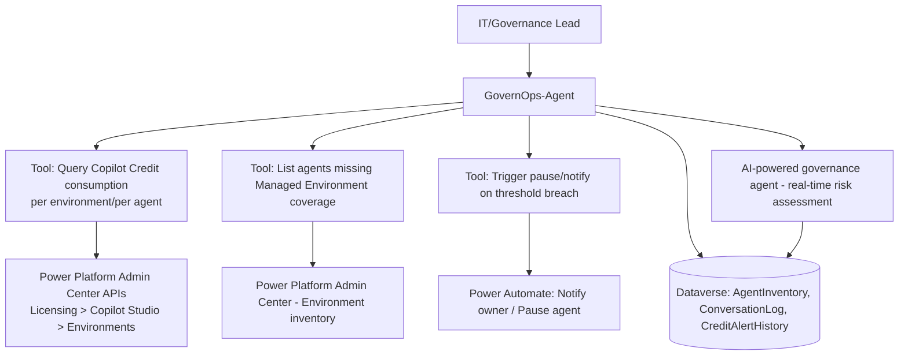

# Project 8 — GovernOps-Agent: Enterprise Governance, Analytics & Credit-Cost Command Center
### 🔴 Difficulty: Expert

**Copilot Studio capability focus:** Power Platform admin center governance, Managed Environments, real-time risk assessment, Copilot Credit monitoring/enforcement, an agent that *governs other agents*
**Data Source:** Power Platform admin telemetry, Dataverse `AgentInventory`/`ConversationLog` tables, Copilot Credit consumption API
**Baseline:** Copilot Studio, as of July 2026 — AI-powered governance agents, consolidated licensing/usage reporting, per-agent consumption caps

---

## 1. What you're building

This project is deliberately different from every other project in this repo: instead of building an agent for *end users*, you build an agent — and a supporting admin dashboard — **for the people governing every other agent in this repo**. GovernOps-Agent answers questions like "which agents are closest to their Copilot Credit cap this month?", "which environments have unmanaged/ungoverned agents?", and "flag any agent whose usage pattern changed sharply this week," and can trigger real remediation actions (pausing an agent, notifying an owner) when configured thresholds are crossed.

## 2. Why this is Expert

Building governance tooling requires you to understand the **entire licensing and consumption model across every other project in this repo simultaneously**, plus admin-center APIs and telemetry that most makers never touch. It's the project that turns "I can build agents" into "I can be trusted to operate a fleet of them in production."

## 3. Architecture

## 4. Step-by-step

1. Build a **Dataverse `AgentInventory` table**: one row per agent across the tenant, capturing owner, environment, license type (M365-included vs. standalone), monthly credit cap, and business purpose — this is the artifact Project 7 told you to maintain; here, you make it queryable by an agent.
2. Connect GovernOps-Agent to the **Power Platform admin center's Copilot Studio licensing/consumption data** (via the appropriate admin APIs/connectors) so it can answer "how many credits has Agent X consumed this month" conversationally instead of requiring a portal login.
3. Build a tool that cross-references **live environments** against the `AgentInventory` table to surface **shadow agents** — agents that exist in an environment but aren't in your governance record, a very real problem once self-service agent creation is enabled broadly.
4. Enable and configure the tenant's **AI-powered governance agent** (Microsoft's own admin-center capability) for **real-time risk assessment** — anomalous access patterns, unusual spikes in autonomous triggers, agents suddenly calling new external connectors — and pipe its flagged events into your `AgentInventory`/alerting flow.
5. Build a **threshold-breach action**: when an agent crosses, say, 90% of its monthly Copilot Credit cap, GovernOps-Agent triggers a Power Automate flow that notifies the agent's owner and, for a defined severity tier, can **pause the agent** pending review (a real, consequential action — treat it with the same confirm-before-act discipline as Project 3).
6. Build a **monthly consolidated report**: total Copilot Credit spend by environment/department, breakdown of PAYG vs. prepaid-pack vs. Agent Pre-Purchase Plan (ACU) consumption, and a forecast for next month based on trend — the exact multi-layer visibility problem enterprises report as their top FinOps pain point.
7. Add a conversational forecasting tool wrapping the **Copilot Studio agent usage estimator** logic, so a manager can ask "if we add 200 more users to the IT helpdesk agent, what's our new monthly cost?" and get a grounded estimate instead of guessing.
8. Document an explicit **enforcement policy runbook**: what happens automatically (soft alert at 75%, hard alert + owner notification at 90%, pause pending approval at 100% for non-PAYG environments) versus what always requires a human decision.

## 5. Token / Copilot Credit utilization

This project is unusual: it's an agent whose entire purpose is to reduce the very cost category it also consumes. Model that honestly:

| Interaction type | Approx. Copilot Credits | Notes |
|---|---|---|
| Admin querying consumption data conversationally | ~2-5 credits per query | Cheap — this is mostly structured lookups, not heavy reasoning |
| Threshold-breach automated check (scheduled/autonomous) | 25 credits per autonomous trigger | Same flat autonomous-trigger rate noted in Project 3 — running this check hourly across many agents adds up; **run it on a sensible cadence (e.g., daily), not continuously** |
| Conversational cost forecasting (wraps the usage estimator) | Moderate — light reasoning tier | Cheap relative to the budgeting mistakes it prevents |

**The meta-lesson this project exists to teach:** governance tooling itself has a Copilot Credit budget line, and an over-eager autonomous monitoring cadence (checking every agent's consumption every 15 minutes, for example) can become a non-trivial cost on its own. Right-size your governance agent's own automation frequency against the actual pace at which consumption changes.

## 6. Licensing checklist
- Requires **Power Platform admin center access** (System Administrator or a scoped admin role) — this is an access-control decision separate from Copilot Studio licensing itself
- The **Managed Environment** feature must be enabled tenant-wide (or per relevant environment) for this project's "who's ungoverned" detection to be meaningful — you can't govern what isn't even inside a managed boundary
- Understand the **four Copilot Credit buying mechanisms** you'll be reporting on: (1) pay-as-you-go at $0.01/credit via Azure, (2) prepaid capacity packs at $200/25,000 credits/month, (3) the Copilot Credit Commit Unit (CCCU) pre-purchase plan with volume discounts (5% at 3,000 CCCUs up to 20% at 3,000,000 CCCUs), and (4) the broader Microsoft Agent Pre-Purchase Plan (ACUs), which draws down across Copilot Studio, Microsoft Foundry, and — per Microsoft's stated direction — increasingly Fabric and GitHub agentic services as well
- Flag internally that **AI Builder credits are being folded into the Copilot Credit model** (seeded AI Builder credits end and billing shifts to Copilot Credit rates) — any of your organization's Power Automate/Power Apps AI Builder usage needs to be re-forecast under the new rate card as part of this project's reporting

## 7. Demo script
1. Ask GovernOps-Agent "which agents are over 80% of their monthly credit cap?" — show a real, data-grounded answer pulled from admin telemetry.
2. Ask it to find shadow agents — show it cross-referencing live environments against the governance inventory and surfacing an ungoverned agent.
3. Simulate a threshold breach and show the owner-notification flow firing, and (for the demo) the pause action being proposed for approval rather than auto-executed silently.
4. Ask the "what if we add 200 users" forecasting question — show a grounded, numbers-based projection.
5. Present the monthly consolidated spend report broken down by the four buying mechanisms — this is the artifact a CFO or FinOps lead actually wants to see.

## 8. Skills this project proves
Operating at the admin/governance layer of Copilot Studio (not just the maker layer), designing an agent that safely takes consequential actions on *other* agents, multi-layer cost attribution and forecasting, and translating Microsoft's evolving licensing model into an internally understandable, auditable reporting artifact.

**🔗 Live HTML mockup:** see `index.html` in this folder.
