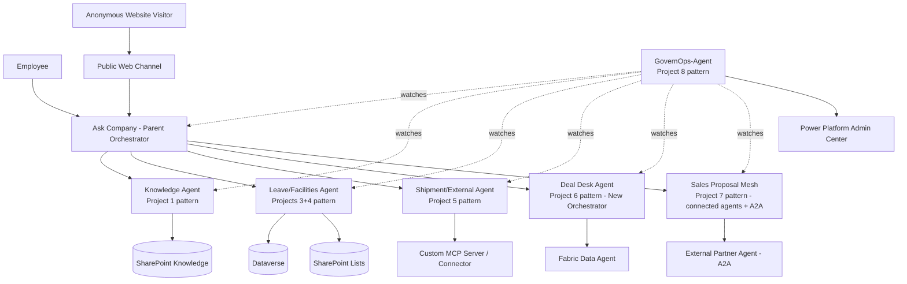

# Project 9 — CAPSTONE: Unified Enterprise Copilot Mesh
### ⭐ Difficulty: Capstone (integrates Beginner → Expert)

**Copilot Studio capability focus:** Every capability from Projects 1-8, unified into one governed, production-shaped system
**Data Source:** SharePoint, Dataverse, public website, external REST API/MCP server, Fabric Data Agent, Power Platform admin telemetry
**Baseline:** Copilot Studio, as of July 2026

---

## 1. What you're building

A single enterprise entry point — **"Ask [Company]"** — that mirrors the real pattern Microsoft used to scale its own customer-facing "Ask Microsoft" agent: **one parent orchestrator** that routes every kind of request (policy questions, leave requests, facilities lookups, shipment tracking, sales proposal drafting) to the right specialist agent from Projects 1-7, all while Project 8's GovernOps-Agent watches over the entire mesh's cost and compliance posture in production.

This is the project to lead with when demonstrating **complete, practitioner-level command of Copilot Studio** — not six disconnected demo bots, but one coherent, governed system.

## 2. Why this is the capstone (and not just "project 7 again")

Project 7 proved you can build a multi-agent mesh. This capstone proves you can take **every difficulty tier's lesson** — cheap knowledge grounding (P1), the external/anonymous cost boundary (P2), safe state-changing actions (P3), structured data with security inheritance (P4), external system integration accountability (P5), autonomous multi-step reasoning with guardrails (P6), distributed multi-agent security (P7) — and operate them together under one governance umbrella (P8), which is what "production-ready" actually means in Copilot Studio.

## 3. Unified architecture

## 4. Step-by-step implementation plan

### Phase 0 — Foundation
1. Stand up a **Managed Environment** dedicated to this mesh; register every planned agent in the `AgentInventory` table from Project 8 **before** building any of them — governance-first, not governance-as-an-afterthought.
2. Define the **parent orchestrator's routing descriptions** for each specialist agent up front — this single artifact determines whether the whole mesh actually routes correctly.

### Phase 1 — Bring in the specialists (reuse, don't rebuild)
3. Connect the **Knowledge Agent** (Project 1 pattern) as a connected agent for all policy/FAQ-style questions.
4. Connect the **Leave/Facilities Agent** (Projects 3+4 pattern) for anything requiring Power Automate actions or Dataverse/SharePoint structured data.
5. Connect the **Shipment/External Agent** (Project 5 pattern) for external-system lookups, carrying forward its non-Microsoft security accountability documentation into this mesh's governance record.
6. Connect the **Deal Desk Agent** (Project 6 pattern, New Orchestrator type) for genuinely multi-step sales reasoning tasks.
7. Connect the **Sales Proposal Mesh** (Project 7 pattern) as a nested system — demonstrating that connected agents can themselves be orchestrators of further sub-agents.

### Phase 2 — Public + internal channel strategy
8. Publish the **internal** experience (employee questions, leave, facilities, deal desk) to Teams — largely zero-rated for M365 Copilot licensed users, per Project 1/3's licensing lessons.
9. Publish a **separate, narrower public web experience** (product/shipment questions only — never leave requests or deal desk) to the anonymous Web channel, explicitly reusing Project 2's guardrail and billing lessons so you don't accidentally expose internal-only agents publicly.

### Phase 3 — Govern the whole thing
10. Point **GovernOps-Agent** (Project 8) at every agent in this mesh: consumption caps per agent, shadow-agent detection across the whole environment, and the AI-powered governance agent's real-time risk assessment watching all of it.
11. Build the **consolidated monthly report** for this specific system: total mesh cost broken down by specialist agent, internal (zero-rated) vs. external (metered) usage split, and a forecast for the next quarter's planned user rollout.

### Phase 4 — Prove it under load
12. Run a **mixed-scenario test script** in one sitting: a policy question, a leave request, a facilities ticket, a shipment lookup, and a full deal-package request — all through the same parent entry point — confirming the orchestrator routes each correctly and hands off context cleanly.
13. Deliberately trigger **one failure and one guardrail** in the same session (e.g., break a connector, then ask for an out-of-policy discount) to prove the mesh fails safely and blocks unsafe actions even under a realistic, messy conversation.

## 5. Token / Copilot Credit utilization — mesh-wide view

| Scenario | Approx. Copilot Credits | Licensing note |
|---|---|---|
| Internal employee, simple policy question | ~2 credits | Zero-rated if M365 Copilot licensed + Teams channel |
| Internal employee, leave request (action) | ~7-12 credits | Zero-rated for the base conversation; agent-flow/action lines may still bill separately — verify current rate card |
| Anonymous public visitor, shipment question | ~5-10 credits | **Always metered** — external/anonymous, per Project 2 and 5's lessons |
| Complex deal-desk multi-step request | 25-40+ credits | Premium reasoning tier, per Project 6 |
| Full cross-agent sales proposal (Project 7 pattern nested inside capstone) | 60-100+ credits | Additive across every connected agent touched, per Project 7 |
| GovernOps-Agent's own daily monitoring pass across the whole mesh | Modest, but non-zero — budget it explicitly | Per Project 8's meta-lesson: governance has its own line item |

**The single most important number to present to your manager:** blend these scenario costs against your organization's actual expected traffic mix (mostly cheap internal Q&A, a smaller share of expensive multi-agent reasoning) using the **Copilot Studio agent usage estimator**, and compare the result against the four buying mechanisms from Project 8 (PAYG, prepaid capacity pack, CCCU pre-purchase, Agent Pre-Purchase Plan/ACU) to recommend the right one for your organization's volume and predictability profile.

## 6. Licensing summary for the whole mesh
- Internal-only, licensed-user, in-Microsoft-365-surface usage → largely zero-rated; this should be the majority of your traffic by design
- Any external, anonymous, or cross-platform (A2A) usage → always metered, always requires standalone Copilot Studio licensing and a funded billing mechanism
- Every agent in the mesh needs independent governance coverage — a mesh's compliance posture is only as strong as its least-governed connected agent
- Plan for the **AI Builder → Copilot Credit consolidation** in your forward budget, since this mesh likely touches Power Automate/AI Builder-adjacent capabilities indirectly through Projects 3-4's flows

## 7. Demo script (the one to run for your manager)
1. Ask a simple policy question through Teams — instant, cited, essentially free.
2. Request leave in the same conversation — show the Adaptive Card approval flow firing.
3. Ask a facilities question requiring a cross-table Dataverse lookup — show correct routing to the data agent.
4. Switch to the public web widget (different browser/incognito) and ask a shipment-tracking question — show it work anonymously, and note out loud that this is now a metered interaction.
5. Go back to the employee conversation and ask the full multi-step deal-desk/proposal request — show the New Orchestrator and the connected-agent mesh handling it end-to-end.
6. Open GovernOps-Agent and ask "how much did this whole mesh cost us today, broken down by agent?" — close on the consolidated cost report, because that's the slide that gets this project funded for real production use.

## 8. Skills this project proves
Everything in Projects 1-8, integrated: knowledge grounding, safe action execution, structured data security, external system integration accountability, autonomous multi-step reasoning with guardrails, distributed multi-agent security, and full-mesh governance and cost forecasting — the complete profile of someone who can design, build, and **operate** an enterprise Copilot Studio estate, not just author individual bots.

**🔗 Live HTML mockup:** see `index.html` in this folder.
